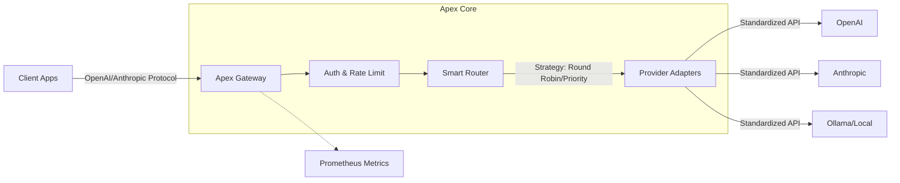

# Apex: The Team-First AI Gateway


**Apex** is a high-performance, open-source AI Gateway designed for teams. It sits between your applications and LLM providers (OpenAI, Anthropic, DeepSeek, etc.), providing a unified API, intelligent routing, cost control, and observability.

Built in **Rust** for low latency and high concurrency.

## 🚀 Why Apex?

Unlike personal AI gateways, Apex is built for **Teams**:

| Feature | Apex (Team Gateway) | Personal Gateways |
| :--- | :--- | :--- |
| **Unified API** | OpenAI & Anthropic Compatible | Usually OpenAI only |
| **Multi-Model Routing** | Round-Robin, Priority, Weighted | Basic fallback |
| **Provider Agnostic** | OpenAI, Anthropic, DeepSeek, Ollama, etc. | Limited support |
| **Observability** | Prometheus Metrics & Grafana Ready | Basic logs |
| **Performance** | Rust-based, sub-millisecond overhead | Often Python/Node.js |
| **Resilience** | Automatic Retries & Fallbacks | Basic |

## 🏗 Architecture



## ⚡️ 5-Minute Quick Start

Get a fully functional AI Gateway running with a mock provider in less than 5 minutes.

### 1. Prerequisites
- Docker & Docker Compose
- *Or* Rust toolchain (if building from source)

### 2. Start with Docker Compose
We provide a pre-configured setup with a **Mock Provider**, so you can test the gateway immediately without needing an API key.

```bash
# Clone the repository
git clone https://github.com/your-org/apex.git
cd apex

# Start Apex Gateway and Mock Provider
docker-compose up -d
```

### 3. Make your first request
Apex is now running at `http://localhost:12356`. Try sending a chat completion request:

```bash
curl http://localhost:12356/v1/chat/completions \
  -H "Content-Type: application/json" \
  -H "Authorization: Bearer sk-apex-demo" \
  -d '{
    "model": "gpt-4",
    "messages": [{"role": "user", "content": "Hello!"}]
  }'
```

> **Note**: `sk-apex-demo` is a pre-configured demo key in `config.example.json`.

You should receive a response from the mock provider:
```json
{
  "id": "chatcmpl-mock",
  "choices": [{
    "message": { "role": "assistant", "content": "Response from mock-1" }
  }]
}
```

### 4. Switch to Real Providers
To use real providers (OpenAI, Anthropic, etc.):
1. Copy `config.example.json` to `config.json`.
2. Edit `config.json` and add your API keys.
3. Update `docker-compose.yml` to mount your `config.json`.

## 📦 Installation (Standalone)

If you prefer to run the binary directly:

```bash
cargo install --path .
apex gateway start
```

## 📚 Documentation

- [Operation Guide](docs/operations.md): detailed configuration and routing strategies.
- [Architecture](docs/architecture.md): design principles.
- [中文文档](README_zh-CN.md): Chinese documentation.

## 🤝 Community & Governance

- [Contributing Guide](CONTRIBUTING.md)
- [Code of Conduct](CODE_OF_CONDUCT.md)
- [Security Policy](SECURITY.md)

## 📄 License

MIT License.
