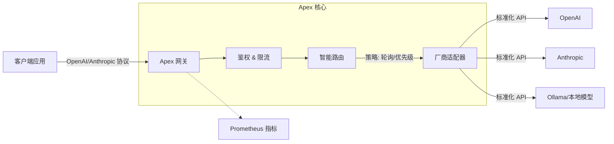

# Apex: 面向团队的 AI 网关


**Apex** 是一个高性能、开源的 AI 网关，专为团队设计。它位于您的应用程序和 LLM 提供商（OpenAI, Anthropic, DeepSeek 等）之间，提供统一的 API、智能路由、成本控制和可观测性。

基于 **Rust** 构建，具有低延迟和高并发特性。

## 🚀 为什么选择 Apex?

与个人 AI 网关不同，Apex 是为 **团队** 构建的：

| 功能 | Apex (团队网关) | 个人网关 |
| :--- | :--- | :--- |
| **统一 API** | 兼容 OpenAI & Anthropic | 通常仅支持 OpenAI |
| **多模型路由** | 轮询、优先级、权重 | 基本的故障转移 |
| **多厂商支持** | OpenAI, Anthropic, DeepSeek, Ollama 等 | 支持有限 |
| **可观测性** | Prometheus 指标 & Grafana 面板 | 基本日志 |
| **性能** | Rust 核心，亚毫秒级开销 | 通常为 Python/Node.js |
| **弹性** | 自动重试 & 故障转移 | 基本功能 |

## 🏗 架构



## ⚡️ 5 分钟快速开始

在 5 分钟内启动一个全功能的 AI 网关（包含模拟 Provider）。

### 1. 前置要求
- Docker & Docker Compose
- *或者* Rust 工具链 (如果是从源码构建)

### 2. 使用 Docker Compose 启动
我们提供了一个预配置的环境，包含一个 **Mock Provider**，您可以立即测试网关而无需 API Key。

```bash
# 克隆仓库
git clone https://github.com/your-org/apex.git
cd apex

# 启动 Apex 网关和 Mock Provider
docker-compose up -d
```

### 3. 发起第一个请求
Apex 现在运行在 `http://localhost:12356`。尝试发送一个对话请求：

```bash
curl http://localhost:12356/v1/chat/completions \
  -H "Content-Type: application/json" \
  -H "Authorization: Bearer sk-apex-demo" \
  -d '{
    "model": "gpt-4",
    "messages": [{"role": "user", "content": "Hello!"}]
  }'
```

> **注意**: `sk-apex-demo` 是我们在 `config.example.json` 中预设的演示 API Key。

您应该会收到来自 Mock Provider 的响应：
```json
{
  "id": "chatcmpl-mock",
  "choices": [{
    "message": { "role": "assistant", "content": "Response from mock-1" }
  }]
}
```

### 4. 切换到真实 Provider
要使用真实的 Provider（OpenAI, Anthropic 等）：
1. 复制 `config.example.json` 到 `config.json`。
2. 编辑 `config.json` 并添加您的 API Key。
3. 更新 `docker-compose.yml` 以挂载您的 `config.json`。

## 📦 安装 (独立运行)

如果您更喜欢直接运行二进制文件：

```bash
cargo install --path .
apex gateway start
```

## 📚 文档

- [操作手册](docs/operations.md): 详细的配置和路由策略说明。
- [架构文档](docs/architecture.md): 设计原则。
- [English Documentation](README.md): 英文文档。

## 🤝 社区与治理

- [贡献指南](CONTRIBUTING.md)
- [行为准则](CODE_OF_CONDUCT.md)
- [安全策略](SECURITY.md)

## 📄 许可证

MIT License.
